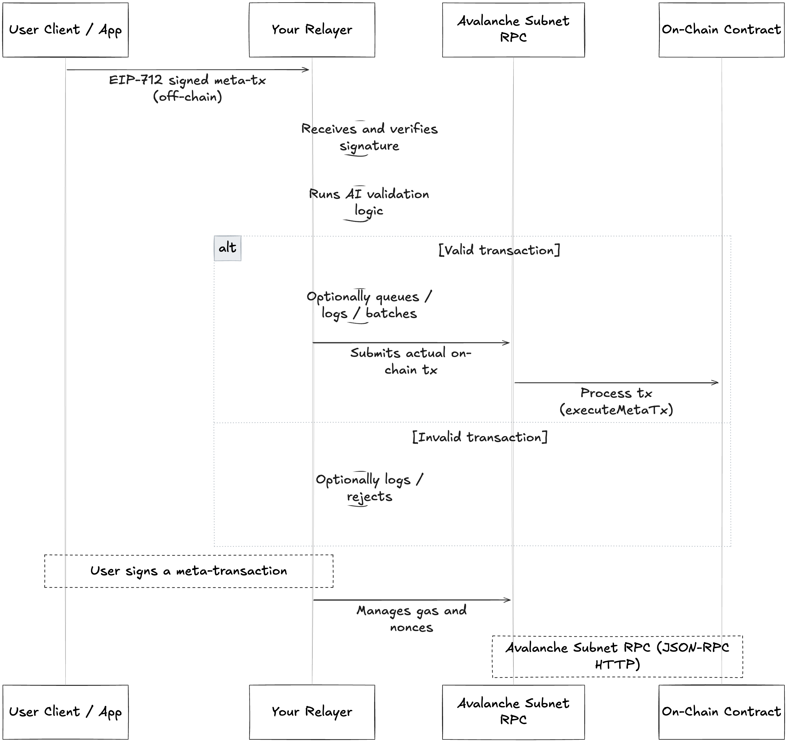

# AI-Validated Smart Wallet System

This project implements AI-validated meta-transaction systems on Ethereum with two different approaches:

1. **EIP-712 with Relayer Service** (in `contracts/` and `relayer/` folders)
2. **EIP-2771 with Forwarder Contract** (in `EIP2771/` folder)

Both implementations provide gasless transactions with AI validation but use different architectural patterns.

## Architecture Overview



*Diagram: High-level architecture showing the interaction between Client, Relayer (with AI validation), and Smart Contract. Place your architecture diagram as `architecture.png` in the project root.*


The system enables gasless transactions through meta-transactions with AI validation:

1. **Smart Contract** (`MetaTxInteraction.sol`): Handles EIP-712 signature verification and meta-transaction execution
2. **Relayer Service** (`relayer/index.js`): Validates transactions using AI rules and relays them to the blockchain
3. **Client Application** (`client/signer.js`): Signs meta-transactions using EIP-712 and sends them to the relayer

## Features

- ✅ **Gasless Transactions**: Users don't need ETH for gas fees
- ✅ **EIP-712 Signatures**: Secure, structured signature format
- ✅ **AI Validation**: Transactions are validated by AI before execution
- ✅ **Nonce Management**: Prevents replay attacks
- ✅ **Meta-Transaction Pattern**: Standard implementation for gasless transactions

## Project Structure

```
new-ai-validator/
├── contracts/                    # EIP-712 Smart contracts (Foundry project)
│   ├── src/
│   │   └── EIPMetaTx.sol        # Main meta-transaction contract
│   ├── script/
│   │   └── EIPMeta.s.sol        # Deployment script
│   ├── test/
│   │   └── EIPMetaTest.t.sol    # Contract tests
│   ├── foundry.toml             # Foundry configuration
│   └── lib/                     # Dependencies (OpenZeppelin, Forge-std)
├── EIP2771/                     # EIP-2771 Implementation (Foundry project)
│   ├── src/
│   │   ├── AIValidatedForwarder.sol      # EIP-2771 forwarder with AI validation
│   │   └── MetaTxInteractionRecipient.sol # EIP-2771 recipient contract
│   ├── script/
│   │   └── DeployLocal.s.sol    # Deployment script
│   ├── test/
│   │   └── EIP2771Test.t.sol    # Contract tests
│   ├── client/
│   │   ├── signer.js            # EIP-2771 client application
│   │   └── package.json         # Node.js dependencies
│   ├── foundry.toml             # Foundry configuration
│   └── README.md                # EIP-2771 specific documentation
├── relayer/                     # Node.js relayer service (for EIP-712)
│   ├── index.js                 # Express server with AI validation
│   └── .env                     # Environment configuration
├── client/                      # Client application (for EIP-712)
│   └── signer.js               # EIP-712 signing and transaction submission
└── README.md                   # This file
```

## Prerequisites

- **Node.js** (v16 or higher)
- **Foundry** (latest version)
- **Anvil** (comes with Foundry)

## Installation & Setup

### 1. Install Dependencies

#### Install Foundry
```bash
curl -L https://foundry.paradigm.xyz | bash
foundryup
```

#### Install Node.js Dependencies
```bash
# For relayer
cd relayer
npm init -y
npm install express ethers dotenv

# For client
cd ../client
npm init -y
npm install ethers axios
```

### 2. Setup Smart Contracts

```bash
cd contracts

# Install OpenZeppelin contracts and Forge Standard Library
git clone https://github.com/foundry-rs/forge-std.git lib/forge-std
git clone https://github.com/OpenZeppelin/openzeppelin-contracts.git lib/openzeppelin-contracts

# Build contracts
forge build
```

### 3. Start Local Blockchain (Anvil)

Open a new terminal and start Anvil:

```bash
anvil
```

This will start a local Ethereum node on `http://127.0.0.1:8545` with pre-funded accounts.

**Important Anvil Output:**
- Note the private keys of the accounts (you'll need them)
- Default chain ID: 31337
- Default accounts have 10,000 ETH each

### 4. Deploy Smart Contract

```bash
cd contracts

# Deploy the contract to Anvil
forge create --rpc-url http://127.0.0.1:8545 \
  --private-key 0xac0974bec39a17e36ba4a6b4d238ff944bacb478cbed5efcae784d7bf4f2ff80 \
  src/EIPMetaTx.sol:MetaTxInteraction
```

**Note the deployed contract address** from the output - you'll need it for configuration.

### 5. Configure Environment

#### Update Relayer Configuration
Edit `relayer/.env`:
```env
RPC_URL=http://127.0.0.1:8545
RELAYER_PRIVATE_KEY=0xac0974bec39a17e36ba4a6b4d238ff944bacb478cbed5efcae784d7bf4f2ff80
CONTRACT_ADDRESS=<YOUR_DEPLOYED_CONTRACT_ADDRESS>
```

#### Update Client Configuration
Edit `client/signer.js` and replace:
- `<user-private-key>`: Use a different private key from Anvil (e.g., the second account)
- `0xYourDeployedContractAddress`: Use your deployed contract address

### 6. Generate Contract ABI

The relayer needs the contract ABI. Generate it:

```bash
cd contracts

# Build and extract ABI
forge build

# Copy ABI to relayer directory
cat out/EIPMetaTx.sol/MetaTxInteraction.json | jq '.abi' > ../relayer/MetaTxInteraction.json
```

If you don't have `jq`, manually copy the ABI from `out/EIPMetaTx.sol/MetaTxInteraction.json` to `relayer/MetaTxInteraction.json`.

## Running the System

### 1. Start Anvil (if not already running)
```bash
anvil
```

### 2. Start the Relayer Service
```bash
cd relayer
node index.js
```

The relayer will start on `http://localhost:4000`.

### 3. Run the Client
```bash
cd client
node signer.js
```

This will:
1. Sign a meta-transaction using EIP-712
2. Send it to the relayer
3. The relayer validates it with AI rules
4. If valid, the relayer submits the transaction to the blockchain
5. You'll see the transaction hash in the console

## How It Works

### Meta-Transaction Flow

1. **Client Signs**: User signs a structured message (EIP-712) containing:
   - User address
   - Interaction string (e.g., "liked_post")
   - Nonce (prevents replay attacks)

2. **Relayer Validates**: The relayer service:
   - Receives the signed meta-transaction
   - Validates it using AI rules (currently accepts interactions starting with "liked_" or "comment_")
   - If valid, calls the smart contract

3. **Contract Executes**: The smart contract:
   - Verifies the EIP-712 signature
   - Checks the nonce to prevent replay attacks
   - Executes the interaction
   - Emits an event

### EIP-712 Domain

```javascript
const domain = {
  name: 'QoneqtMetaTx',
  version: '1',
  chainId: 31337,  // Anvil's default chain ID
  verifyingContract: contractAddress
};
```

### AI Validation Rules

Currently implemented as a simple filter in the relayer:
- Accepts interactions starting with "liked_"
- Accepts interactions starting with "comment_"
- Rejects all other interactions

You can extend this with more sophisticated AI validation logic.

## Implementation Comparison

This project includes two different approaches to AI-validated meta-transactions:

### EIP-712 with Relayer Service (`contracts/` + `relayer/`)
- **Architecture**: Client → Relayer Service → Smart Contract
- **Validation**: Off-chain AI validation in Node.js service
- **Standard**: Custom EIP-712 implementation
- **Pros**: Flexible validation logic, easy to update rules
- **Cons**: Requires service maintenance, centralized relayer

### EIP-2771 with Forwarder Contract (`EIP2771/`)
- **Architecture**: Client → Forwarder Contract → Recipient Contract
- **Validation**: On-chain AI validation in smart contract
- **Standard**: Standard EIP-2771 compliance
- **Pros**: Decentralized, standardized, no service dependencies
- **Cons**: Less flexible, requires contract upgrades for rule changes

Choose the approach that best fits your use case:
- Use **EIP-712** for maximum flexibility and complex AI logic
- Use **EIP-2771** for standardization and decentralized validation

## Quick Start

### For EIP-712 Implementation:
```bash
# Follow the original setup instructions below
cd contracts && forge build
cd ../relayer && npm install
# ... (continue with existing instructions)
```

### For EIP-2771 Implementation:
```bash
cd EIP2771
forge install
forge test
# See EIP2771/README.md for detailed instructions
```

## Testing

### Run Contract Tests
```bash
cd contracts
forge test -vv
```

### Manual Testing
1. Ensure Anvil is running
2. Deploy the contract
3. Start the relayer
4. Run the client with different interaction strings to test AI validation

## Development

### Contract Development
- Contracts are in `contracts/src/`
- Tests are in `contracts/test/`
- Use `forge build` to compile
- Use `forge test` to run tests

### Relayer Development
- The relayer is a simple Express.js server
- Modify AI validation logic in `relayer/index.js`
- Add more sophisticated AI models or rules as needed

### Client Development
- The client demonstrates EIP-712 signing
- Extend it to support different interaction types
- Add error handling and user interface as needed

## Troubleshooting

### Common Issues

1. **"Invalid signature" error**: 
   - Check that the user private key matches the address
   - Verify the EIP-712 domain parameters match between client and contract

2. **"Contract not found" error**:
   - Ensure the contract is deployed and the address is correct
   - Verify Anvil is running on the correct port

3. **"Invalid nonce" error**:
   - Nonces must be sequential
   - Check the current nonce for the user address

4. **"Interaction rejected by AI filter"**:
   - The interaction doesn't match the AI validation rules
   - Try interactions starting with "liked_" or "comment_"

### Useful Commands

```bash
# Check account balance
cast balance <ADDRESS> --rpc-url http://127.0.0.1:8545

# Get current nonce for an address
cast call <CONTRACT_ADDRESS> "nonces(address)(uint256)" <USER_ADDRESS> --rpc-url http://127.0.0.1:8545

# View transaction receipt
cast receipt <TX_HASH> --rpc-url http://127.0.0.1:8545

# Get contract events
cast logs --from-block 0 --address <CONTRACT_ADDRESS> --rpc-url http://127.0.0.1:8545
```

## Next Steps

1. **Enhanced AI Validation**: Integrate with real AI services (OpenAI, Anthropic, etc.)
2. **Frontend Interface**: Build a web interface for users
3. **Multiple Interaction Types**: Support various transaction types
4. **Gas Optimization**: Optimize contract gas usage
5. **Security Audits**: Perform comprehensive security testing
6. **Mainnet Deployment**: Deploy to Ethereum mainnet or L2 solutions

## Security Considerations

- Private keys are hardcoded in examples - use secure key management in production
- AI validation is basic - implement comprehensive validation for production use
- Test thoroughly before mainnet deployment
- Consider rate limiting and DoS protection for the relayer
- Implement proper error handling and logging

## License

MIT License - feel free to use and modify for your projects.
