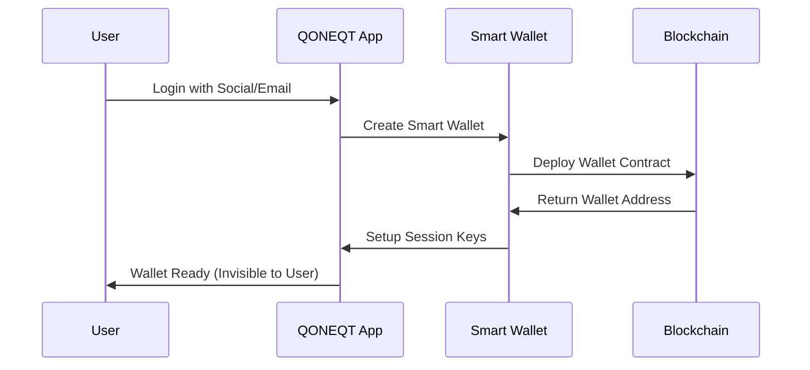
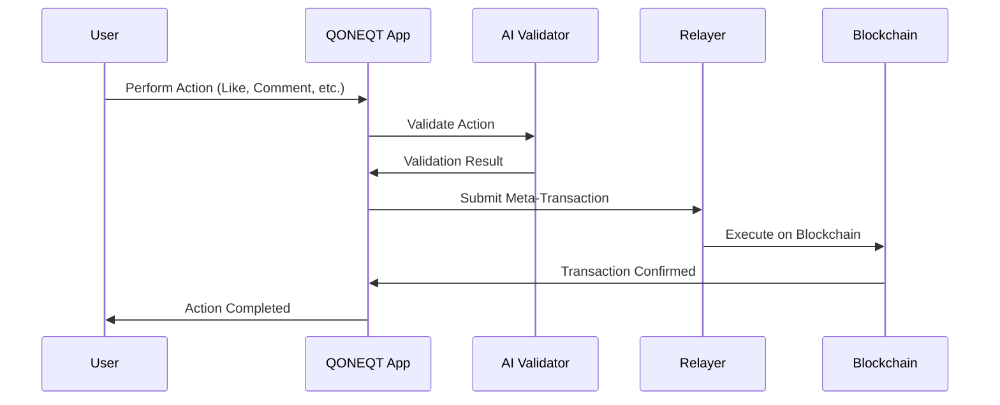

# QONEQT Smart Wallet Implementation
## Seamless Web2 to Web3 User Onboarding


## Overview

This smart wallet implementation enables seamless **Web2 to Web3 onboarding** for QONEQT users without the complexity of traditional crypto wallets. Users can interact with blockchain applications using familiar Web2 authentication methods while enjoying gasless transactions and AI-powered content validation.

## Key Objectives

- **Zero Crypto Knowledge Required**: Users don't need to understand private keys, gas fees, or wallet management
- **Gasless Interactions**: All transactions are sponsored through meta-transactions
- **AI-Powered Security**: Intelligent content validation and fraud prevention
- **Familiar UX**: Web2-like experience with Web3 benefits
- **Seamless Integration**: Easy integration with existing QONEQT infrastructure

## Architecture Overview

```
┌─────────────────┐    ┌─────────────────┐    ┌─────────────────┐
│   Web2 User     │    │  Smart Wallet   │    │  Blockchain     │
│                 │    │    System       │    │   Network       │
├─────────────────┤    ├─────────────────┤    ├─────────────────┤
│ • Social Login  │───▶│ • Session Keys  │───▶│ • EIP-2771      │
│ • Email/SMS     │    │ • Meta-Tx Pool  │    │ • EIP-712       │
│ • Biometrics    │    │ • AI Validator  │    │ • Smart Contracts│
│ • QONEQT Token  │    │ • Gas Station   │    │ • Account Factory│
└─────────────────┘    └─────────────────┘    └─────────────────┘
```

## Technical Implementation

### Core EIPs & Standards

#### 1. **EIP-2771: Meta-Transaction Standard**
- **Location**: `../EIP2771/`
- **Purpose**: Gasless transaction execution through trusted forwarders
- **Implementation**: 
  - `AIValidatedForwarder.sol` - Enhanced forwarder with AI validation
  - `MetaTxInteractionRecipient.sol` - Target contract accepting meta-transactions

```solidity
// Example usage in your smart wallet
contract QoneqtSmartWallet is ERC2771Context {
    constructor(address forwarder) ERC2771Context(forwarder) {}
    
    function executeUserAction(string memory action) external {
        address user = _msgSender(); // Returns original user, not relayer
        // Execute user action gaslessly
    }
}
```

#### 2. **EIP-712: Structured Data Signing**
- **Location**: `../EIP712/`
- **Purpose**: Secure, human-readable transaction signing
- **Implementation**:
  - Direct signature validation without forwarders
  - Lower gas costs for simple operations

```javascript
// Example EIP-712 signing for QONEQT users
const domain = {
    name: 'QoneqtSmartWallet',
    version: '1',
    chainId: 43114, // Avalanche
    verifyingContract: walletAddress
};

const types = {
    UserAction: [
        { name: 'user', type: 'address' },
        { name: 'action', type: 'string' },
        { name: 'timestamp', type: 'uint256' },
        { name: 'nonce', type: 'uint256' }
    ]
};
```

#### 3. **EIP-4337: Account Abstraction** (Recommended)
```solidity
// Smart Wallet Factory for QONEQT users
contract QoneqtWalletFactory {
    function createWallet(
        address owner,
        string memory socialId,
        uint256 salt
    ) external returns (address wallet) {
        // Deploy deterministic smart wallet
        wallet = Clones.cloneDeterministic(implementation, salt);
        QoneqtSmartWallet(wallet).initialize(owner, socialId);
    }
}
```

## Onboarding Strategies

### 1. **Social Authentication Smart Wallets**

#### Implementation Approach:
```javascript
// Example: Google OAuth → Smart Wallet Creation
class QoneqtSocialWallet {
    async createWalletFromSocial(socialToken, provider) {
        // 1. Verify social token with provider
        const socialProfile = await this.verifySocialToken(socialToken, provider);
        
        // 2. Generate deterministic wallet address
        const salt = ethers.utils.keccak256(
            ethers.utils.defaultAbiCoder.encode(
                ['string', 'string'],
                [provider, socialProfile.id]
            )
        );
        
        // 3. Create smart wallet
        const walletAddress = await this.factory.createWallet(
            this.masterSigner.address,
            socialProfile.id,
            salt
        );
        
        // 4. Store session keys for gasless transactions
        await this.setupSessionKeys(walletAddress, socialProfile);
        
        return walletAddress;
    }
}
```

#### Benefits:
- No private key management
- Familiar login experience
- Social recovery options
- Cross-device accessibility

### 2. **Email/SMS Based Wallets**

#### Implementation:
```javascript
class EmailSmartWallet {
    async createWalletFromEmail(email) {
        // 1. Send verification code
        const verificationCode = await this.sendVerificationEmail(email);
        
        // 2. User confirms code
        const isVerified = await this.verifyCode(email, verificationCode);
        
        // 3. Generate wallet using email hash as salt
        const salt = ethers.utils.keccak256(ethers.utils.toUtf8Bytes(email));
        const walletAddress = await this.factory.createWallet(
            this.masterSigner.address,
            email,
            salt
        );
        
        return walletAddress;
    }
}
```

### 3. **Biometric Authentication** (Mobile)

#### Implementation using WebAuthn:
```javascript
class BiometricWallet {
    async createBiometricWallet() {
        // 1. Generate WebAuthn credentials
        const credential = await navigator.credentials.create({
            publicKey: {
                challenge: new Uint8Array(32),
                rp: { name: "QONEQT" },
                user: {
                    id: new Uint8Array(16),
                    name: "user@qoneqt.com",
                    displayName: "QONEQT User"
                },
                pubKeyCredParams: [{ alg: -7, type: "public-key" }]
            }
        });
        
        // 2. Use credential ID as wallet salt
        const salt = ethers.utils.keccak256(credential.rawId);
        
        // 3. Create smart wallet
        return await this.factory.createWallet(
            this.masterSigner.address,
            credential.id,
            salt
        );
    }
}
```

## Security & Session Management

### Session Key Architecture

```solidity
contract QoneqtSessionManager {
    struct SessionKey {
        address key;
        uint256 validUntil;
        uint256 spendingLimit;
        string[] allowedActions;
    }
    
    mapping(address => mapping(address => SessionKey)) public sessionKeys;
    
    function createSession(
        address wallet,
        address sessionKey,
        uint256 duration,
        uint256 limit,
        string[] memory actions
    ) external onlyWalletOwner(wallet) {
        sessionKeys[wallet][sessionKey] = SessionKey({
            key: sessionKey,
            validUntil: block.timestamp + duration,
            spendingLimit: limit,
            allowedActions: actions
        });
    }
}
```

### AI-Powered Security

Building on the existing AI validation system in `../EIP2771/ollama-ai-service.js`:

```javascript
class QoneqtAISecurity {
    async validateUserAction(action, userProfile, context) {
        const prompt = `
        Analyze this user action for security risks:
        Action: ${action}
        User History: ${userProfile.actionHistory}
        Context: ${context}
        
        Check for:
        1. Suspicious patterns
        2. Potential fraud
        3. Social engineering
        4. Unusual spending behavior
        
        Return: { safe: boolean, confidence: number, reasoning: string }
        `;
        
        const response = await this.ollamaService.generate({
            model: 'llama3.2:3b',
            prompt: prompt,
            format: 'json'
        });
        
        return JSON.parse(response.response);
    }
}
```

## Gas Management & Sponsorship

### 1. **Gas Station Network Integration**

```javascript
class QoneqtGasStation {
    constructor(gsnProvider, paymaster) {
        this.provider = gsnProvider;
        this.paymaster = paymaster;
    }
    
    async sponsorTransaction(userWallet, transaction) {
        // Check if user is eligible for gas sponsorship
        const isEligible = await this.checkSponsorship(userWallet);
        
        if (isEligible) {
            // Execute through GSN
            return await this.relayTransaction(transaction);
        } else {
            // Fallback to user-paid gas
            throw new Error('Gas sponsorship not available');
        }
    }
}
```

### 2. **Token-Based Gas Payments**

```solidity
contract QoneqtGasPaymaster {
    IERC20 public qoneqtToken;
    
    function payForGasWithTokens(
        address user,
        uint256 gasAmount,
        uint256 tokenAmount
    ) external {
        // Convert QONEQT tokens to gas payment
        require(qoneqtToken.transferFrom(user, address(this), tokenAmount));
        
        // Execute transaction with sponsored gas
        _sponsorGas(user, gasAmount);
    }
}
```

## Integration Workflows

### 1. **New User Onboarding Flow**



### 2. **Transaction Execution Flow**



### 3. **Recovery & Migration Flow**

```javascript
class WalletRecovery {
    async recoverWallet(socialProof, newDevice) {
        // 1. Verify social identity
        const isValid = await this.verifySocialProof(socialProof);
        
        // 2. Generate same deterministic address
        const walletAddress = await this.computeWalletAddress(socialProof);
        
        // 3. Setup new session keys for new device
        await this.setupSessionKeys(walletAddress, newDevice);
        
        // 4. Migrate to new master key if needed
        if (socialProof.requiresNewMaster) {
            await this.migrateMasterKey(walletAddress, newDevice.publicKey);
        }
        
        return walletAddress;
    }
}
```

## Platform-Specific Implementations

### **Mobile App Integration**

```javascript
// React Native / Flutter
class QoneqtMobileWallet {
    async initializeWallet() {
        // Use device-specific secure storage
        const deviceId = await this.getSecureDeviceId();
        const biometricKey = await this.generateBiometricKey();
        
        return await this.createWallet({
            authMethod: 'biometric',
            deviceId: deviceId,
            publicKey: biometricKey
        });
    }
}
```

### **Web App Integration**

```javascript
// Web Browser
class QoneqtWebWallet {
    async initializeWallet() {
        // Use browser-based authentication
        if (this.supportsBiometrics()) {
            return await this.createBiometricWallet();
        } else {
            return await this.createSocialWallet();
        }
    }
}
```

### **Backend API Integration**

```javascript
// Express.js API
app.post('/api/wallet/create', async (req, res) => {
    const { authType, credentials } = req.body;
    
    try {
        let walletAddress;
        
        switch (authType) {
            case 'social':
                walletAddress = await createSocialWallet(credentials);
                break;
            case 'email':
                walletAddress = await createEmailWallet(credentials);
                break;
            case 'biometric':
                walletAddress = await createBiometricWallet(credentials);
                break;
        }
        
        res.json({ success: true, walletAddress });
    } catch (error) {
        res.status(400).json({ error: error.message });
    }
});
```

## Development Setup

### Prerequisites

```bash
# Install dependencies
npm install

# Install Foundry for smart contracts
curl -L https://foundry.paradigm.xyz | bash
foundry

# Install Ollama for AI services
curl -fsSL https://ollama.com/install.sh | sh
ollama pull llama3.2:3b
```

### Environment Setup

```bash
# Clone and setup
git clone <repository>
cd smart-wallet

# Setup EIP-2771 environment
cd ../EIP2771
./setup.sh

# Setup EIP-712 environment  
cd ../EIP712
./setup.sh

# Return to smart wallet directory
cd ../smart-wallet
```

### Configuration

```javascript
// config/wallet.config.js
module.exports = {
    networks: {
        avalanche: {
            rpc: 'https://api.avax.network/ext/bc/C/rpc',
            chainId: 43114
        },
        local: {
            rpc: 'http://localhost:9650/ext/bc/HekfYrK1fxgzkBSPj5XwBUNfxvZuMS7wLq7p7r6bQQJm6jA2M/rpc',
            chainId: 930393
        }
    },
    ai: {
        ollamaUrl: 'http://localhost:11434',
        model: 'llama3.2:3b'
    },
    gasStation: {
        enabled: true,
        relayerUrl: 'http://localhost:3001'
    }
};
```

## Deployment Guide

### 1. **Smart Contract Deployment**

```bash
# Deploy core contracts
forge script script/DeployQoneqtWallet.s.sol:DeployQoneqtWallet --rpc-url $RPC_URL --broadcast

# Verify contracts
forge verify-contract --chain-id 43114 --constructor-args $(cast abi-encode "constructor(address)" $FORWARDER_ADDRESS) $WALLET_ADDRESS src/QoneqtSmartWallet.sol:QoneqtSmartWallet
```

### 2. **AI Service Deployment**

```bash
# Start Ollama service
ollama serve

# Start AI validation service
cd ../EIP2771
node ollama-ai-service.js
```

### 3. **Frontend Integration**

```javascript
// Example React integration
import { QoneqtWalletSDK } from '@qoneqt/smart-wallet';

function App() {
    const [wallet, setWallet] = useState(null);
    
    const handleSocialLogin = async (provider) => {
        const sdk = new QoneqtWalletSDK({
            network: 'avalanche',
            aiValidation: true
        });
        
        const walletAddress = await sdk.createWalletFromSocial(provider);
        setWallet(walletAddress);
    };
    
    return (
        <div>
            <button onClick={() => handleSocialLogin('google')}>
                Login with Google
            </button>
            {wallet && <p>Wallet: {wallet}</p>}
        </div>
    );
}
```

## Monitoring & Analytics

### Wallet Analytics Dashboard

```javascript
class WalletAnalytics {
    async getWalletMetrics(timeframe = '7d') {
        return {
            totalWallets: await this.getTotalWallets(),
            activeWallets: await this.getActiveWallets(timeframe),
            transactionVolume: await this.getTransactionVolume(timeframe),
            aiValidationStats: await this.getAIValidationStats(timeframe),
            gasSponsored: await this.getGasSponsored(timeframe)
        };
    }
}
```

### Security Monitoring

```javascript
class SecurityMonitor {
    async detectAnomalies(walletAddress) {
        const metrics = await this.getWalletMetrics(walletAddress);
        
        const alerts = [];
        
        if (metrics.transactionFrequency > this.thresholds.suspicious) {
            alerts.push('HIGH_FREQUENCY_TRANSACTIONS');
        }
        
        if (metrics.newDeviceLogins > this.thresholds.deviceLimit) {
            alerts.push('MULTIPLE_DEVICE_ACCESS');
        }
        
        return alerts;
    }
}
```

## 🔮 Future Enhancements

### 1. **Multi-Chain Support**
- Seamless cross-chain operations
- Unified balance across networks
- Cross-chain recovery mechanisms

### 2. **Advanced AI Features**
- Personalized spending limits
- Intelligent transaction scheduling
- Predictive fraud detection
- Natural language transaction interface

### 3. **DeFi Integration**
- Auto-yield optimization
- Simplified DeFi interactions
- Risk assessment for DeFi protocols
- One-click portfolio management

### 4. **Social Features**
- Wallet-to-wallet messaging
- Social recovery networks
- Shared wallets for families/teams
- Social trading features

## 📚 Additional Resources

- [EIP-2771 Specification](https://eips.ethereum.org/EIPS/eip-2771)
- [EIP-712 Specification](https://eips.ethereum.org/EIPS/eip-712)
- [EIP-4337 Account Abstraction](https://eips.ethereum.org/EIPS/eip-4337)
- [OpenZeppelin Meta-Transactions](https://docs.openzeppelin.com/contracts/4.x/api/metatx)
- [Ollama AI Documentation](https://ollama.com/docs)

## 🤝 Contributing

1. Fork the repository
2. Create your feature branch (`git checkout -b feature/amazing-feature`)
3. Commit your changes (`git commit -m 'Add amazing feature'`)
4. Push to the branch (`git push origin feature/amazing-feature`)
5. Open a Pull Request

## 📄 License

This project is licensed under the MIT License - see the [LICENSE](LICENSE) file for details.

----